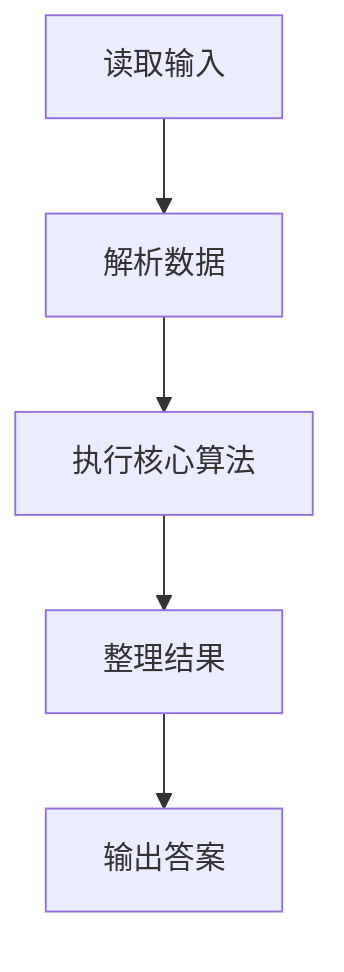
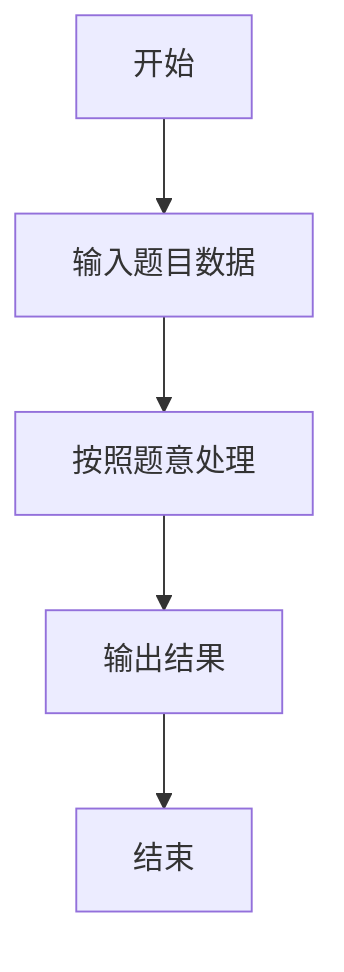

# L3-028 - 森森旅游（30 分）

- **时间限制**: 1000 ms
- **内存限制**: 131072 KB
- **代码长度限制**: 16 KB

---

## 题目描述


好久没出去旅游啦！森森决定去 Z 省旅游一下。

Z 省有 $$n$$ 座城市（从 $$1$$ 到 $$n$$ 编号）以及 $$m$$ 条连接两座城市的有向旅行线路（例如自驾、长途汽车、火车、飞机、轮船等），每次经过一条旅行线路时都需要支付该线路的费用（但这个收费标准可能不止一种，例如车票跟机票一般不是一个价格）。

Z 省为了鼓励大家在省内多逛逛，推出了**旅游金计划**：在 $$i$$ 号城市可以用 $$1$$ 元现金兑换 $$a_i$$ 元旅游金（只要现金足够，可以无限次兑换）。城市间的交通即可以使用现金支付路费，也可以用旅游金支付。具体来说，当通过第 $$j$$ 条旅行线路时，可以用 $$c_j$$ 元现金**或** $$d_j$$ 元旅游金支付路费。**注意：** 每次只能选择一种支付方式，不可同时使用现金和旅游金混合支付。但对于不同的线路，旅客可以自由选择不同的支付方式。

森森决定从 $$1$$ 号城市出发，到 $$n$$ 号城市去。他打算在出发前准备一些现金，并在途中的某个城市将剩余现金 **全部** 换成旅游金后继续旅游，直到到达 $$n$$ 号城市为止。当然，他也可以选择在 $$1$$ 号城市就兑换旅游金，或全部使用现金完成旅程。

Z 省政府会根据每个城市参与活动的情况调整汇率（即调整在某个城市 $$1$$ 元现金能换多少旅游金）。现在你需要帮助森森计算一下，在每次调整之后最少需要携带多少现金才能完成他的旅程。

### 输入格式:

输入在第一行给出三个整数 $$n$$，$$m$$ 与 $$q$$（$$1 \le n \le 10^5$$，$$1 \le m \le 2 \times 10^5$$，$$1 \le q \le 10^5$$），依次表示城市的数量、旅行线路的数量以及汇率调整的次数。

接下来 $$m$$ 行，每行给出四个整数 $$u$$，$$v$$，$$c$$ 与 $$d$$（$$1 \le u, v \le n$$，$$1 \le c, d \le 10^9$$），表示一条从 $$u$$ 号城市通向 $$v$$ 号城市的有向旅行线路。每次通过该线路需要支付 $$c$$ 元现金或 $$d$$ 元旅游金。数字间以空格分隔。输入保证从 $$1$$ 号城市出发，一定可以通过若干条线路到达 $$n$$ 号城市，但两城市间的旅行线路可能不止一条，对应不同的收费标准；也允许在城市内部游玩（即 $$u$$ 和 $$v$$ 相同）。

接下来的一行输入 $$n$$ 个整数 $$a_1, a_2, \cdots, a_n$$（$$1 \le a_i \le 10^9$$），其中 $$a_i$$ 表示一开始在 $$i$$ 号城市能用 $$1$$ 元现金兑换 $$a_i$$ 个旅游金。数字间以空格分隔。

接下来 $$q$$ 行描述汇率的调整。第 $$i$$ 行输入两个整数 $$x_i$$ 与 $$a'_i$$（$$1 \le x_i \le n$$，$$1 \le a'_i \le 10^9$$），表示第 $$i$$ 次汇率调整后，$$x_i$$ 号城市能用 $$1$$ 元现金兑换 $$a'_i$$ 个旅游金，而其它城市旅游金汇率不变。**请注意：**每次汇率调整都是在上一次汇率调整的基础上进行的。

### 输出格式:

对每一次汇率调整，在对应的一行中输出调整后森森至少需要准备多少现金，才能按他的计划从 $$1$$ 号城市旅行到 $$n$$ 号城市。

**再次提醒：**如果森森决定在途中的某个城市兑换旅游金，那么他必须将剩余现金**全部、一次性**兑换，剩下的旅途将完全使用旅游金支付。

### 输入样例:
```in
6 11 3
1 2 3 5
1 3 8 4
2 4 4 6
3 1 8 6
1 3 10 8
2 3 2 8
3 4 5 3
3 5 10 7
3 3 2 3
4 6 10 12
5 6 10 6
3 4 5 2 5 100
1 2
2 1
1 17
```

### 输出样例:
```out
8
8
1
```

## 示例

### 示例 1

**输入:**
```
6 11 3
1 2 3 5
1 3 8 4
2 4 4 6
3 1 8 6
1 3 10 8
2 3 2 8
3 4 5 3
3 5 10 7
3 3 2 3
4 6 10 12
5 6 10 6
3 4 5 2 5 100
1 2
2 1
1 17
```

**输出:**
```
8
8
1
```

### 解题思路

本题的 Ruby 实现采用排序、贪心与顺序模拟。程序先读取题目输入，建立与题意对应的数据结构，按照约束完成核心计算，并按规定格式输出结果。具体实现以同目录的 main.rb 为准。

### 代码流程说明

1. 读取并解析标准输入，转换为题目所需的数据结构。
2. 按题意执行核心算法，维护中间状态并处理边界情况。
3. 整理计算结果，按照输出格式生成答案。

### 代码实现

完整实现位于同目录的 [main.rb](./L3-028_森森旅游/main.rb)，以下代码与该入口文件保持一致。

```ruby
# frozen_string_literal: true
require_relative '../gplt_runtime'
def entry
  dij = lambda do |g, s|
    inf = (10 ** 30)
    d = ([inf] * py_len(g))
    d[s] = 0
    p = [[0, s]]
    while py_truth(p)
      x, u = p.shift
      if ((x != d[u]))
        next
      end
      for v, w in g[u]
        if (((x + w) < d[v]))
          d[v] = (x + w)
          p.push([d[v], v]); p.sort!
        end
      end
    end
    return d
  end
  main = lambda do ||
    a = (py_map(->(x) { py_int(x) }, py_tokens).to_a)
    if (!py_truth(a))
      return
    end
    n, m, q = py_slice(a, nil, 3, nil)
    p = 3
    gc = py_iterable(py_range((n + 1))).flat_map { |_|; [[]] }
    gd = py_iterable(py_range((n + 1))).flat_map { |_|; [[]] }
    for _ in py_range(m)
      u, v, c, d = py_slice(a, p, (p + 4), nil)
      p += 4
      gc[u].append([v, c])
      gd[v].append([u, d])
    end
    rate = ([0] + py_slice(a, p, (p + n), nil))
    p += n
    dc = dij.call(gc, 1)
    dd = dij.call(gd, n)
    inf = (10 ** 30)
    value = lambda do |i|
      return ((((dc[i] >= inf)) || ((dd[i] >= inf))) ? inf : (dc[i] + (((dd[i] + rate[i]) - 1).div(rate[i]))))
    end
    cur = ([0] + py_iterable(py_range(1, (n + 1))).flat_map { |i|; [value.call(i)] })
    out = []
    for _ in py_range(q)
      x, r = py_slice(a, p, (p + 2), nil)
      p += 2
      rate[x] = r
      cur[x] = value.call(x)
      out.append(py_str(py_min(py_slice(cur, 1, nil, nil))))
    end
    py_print(out.join("\n"), sep: " ", ending: "\n")
  end
  main.call
end
entry
```

### 代码流程图



### 解题流程图


