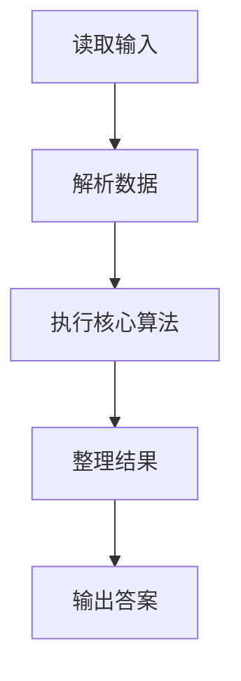
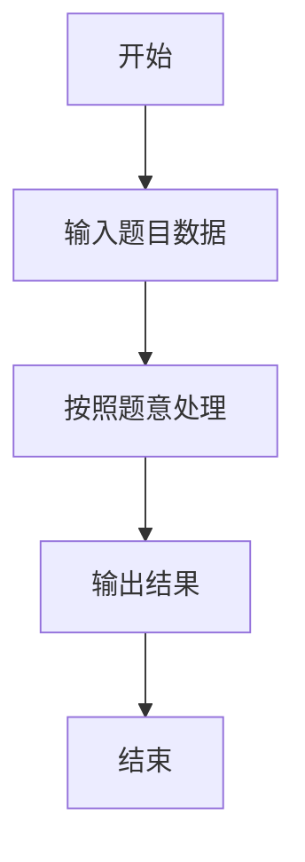

# L3-029 - 还原文件（30 分）

- **时间限制**: 200 ms
- **内存限制**: 65536 KB
- **代码长度限制**: 16 KB

---

## 题目描述


一份重要文件被撕成两半，其中一半还被送进了碎纸机。我们将碎纸机里找到的纸条进行编号，如图 1 所示。然后根据断口的折线形状跟没有切碎的半张纸进行匹配，最后还原成图 2 的样子。要求你输出还原后纸条的正确拼接顺序。


图1 纸条编号


图2 还原结果

### 输入格式:

输入首先在第一行中给出一个正整数 $$N$$（$$1 < N \le 10^5$$），为没有切碎的半张纸上断口折线角点的个数；随后一行给出从左到右 $$N$$ 个折线角点的高度值（均为不超过 100 的非负整数）。

随后一行给出一个正整数 $$M$$（$$\le 100$$），为碎纸机里的纸条数量。接下去有 $$M$$ 行，其中第 $$i$$ 行给出编号为 $$i$$（$$1\le i \le M$$）的纸条的断口信息，格式为：

```
K h[1] h[2] ... h[K]
```

其中 `K` 是断口折线角点的个数（不超过 $$10^4 +1$$），后面是从左到右 `K` 个折线角点的高度值。为简单起见，这个“高度”跟没有切碎的半张纸上断口折线角点的高度是一致的。

### 输出格式:

在一行中输出还原后纸条的正确拼接顺序。纸条编号间以一个空格分隔，行首尾不得有多余空格。

题目数据保证存在唯一解。

### 输入样例:
```in
17
95 70 80 97 97 68 58 58 80 72 88 81 81 68 68 60 80
6
4 68 58 58 80
3 81 68 68
3 95 70 80
3 68 60 80
5 80 72 88 81 81
4 80 97 97 68
```

### 输出样例:
```out
3 6 1 5 2 4
```

## 示例

### 示例 1

**输入:**
```
17
95 70 80 97 97 68 58 58 80 72 88 81 81 68 68 60 80
6
4 68 58 58 80
3 81 68 68
3 95 70 80
3 68 60 80
5 80 72 88 81 81
4 80 97 97 68
```

**输出:**
```
3 6 1 5 2 4
```

### 解题思路

本题的 Ruby 实现采用图遍历或搜索。程序先读取题目输入，建立与题意对应的数据结构，按照约束完成核心计算，并按规定格式输出结果。具体实现以同目录的 main.rb 为准。

### 代码流程说明

1. 读取并解析标准输入，转换为题目所需的数据结构。
2. 按题意执行核心算法，维护中间状态并处理边界情况。
3. 整理计算结果，按照输出格式生成答案。

### 代码实现

完整实现位于同目录的 [main.rb](./L3-029_还原文件/main.rb)，以下代码与该入口文件保持一致。

```ruby
# frozen_string_literal: true
require_relative '../gplt_runtime'
def entry
  nil
  main = lambda do ||
    a = (py_map(->(x) { py_int(x) }, py_tokens).to_a)
    if (!py_truth(a))
      return
    end
    p = 0
    n = a[p]
    p += 1
    h = py_slice(a, p, (p + n), nil)
    p += n
    m = a[p]
    p += 1
    strips = []
    for _ in py_range(m)
      k = a[p]
      p += 1
      strips.append(py_slice(a, p, (p + k), nil))
      p += k
    end
    used = ([false] * m)
    ans = nil
    dfs = lambda do |pos, depth, order|
      if ((!ans.equal?(nil)))
        return
      end
      if ((depth == m))
        if ((pos == n))
          ans = py_slice(order, nil, nil, nil)
        end
        return
      end
      for i, s in py_enumerate(strips)
        if (py_truth(used[i]) || (((pos + py_len(s)) > n)) || ((py_slice(h, pos, (pos + py_len(s)), nil) != s)))
          next
        end
        nxt = ((((depth + 1) == m)) ? (pos + py_len(s)) : ((pos + py_len(s)) - 1))
        if ((((depth + 1) < m)) && ((nxt >= n)))
          next
        end
        used[i] = true
        dfs.call(nxt, (depth + 1), (order + [i]))
        used[i] = false
      end
    end
    dfs.call(0, 0, [])
    if ((!ans.equal?(nil)))
      py_print(py_iterable(ans).flat_map { |i|; [py_str((i + 1))] }.join(" "), sep: " ", ending: "\n")
    end
  end
  main.call
end
entry
```

### 代码流程图



### 解题流程图


