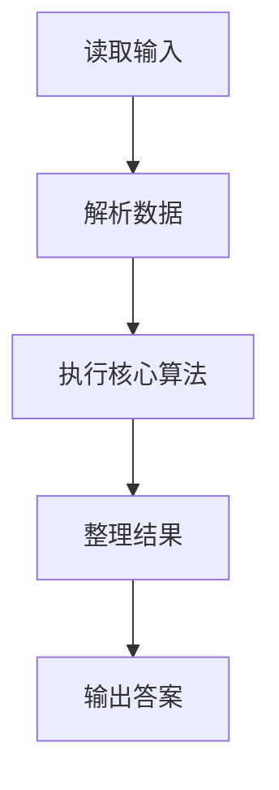
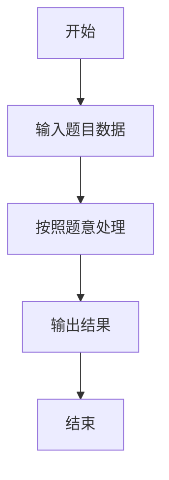

# L3-030 - 可怜的简单题（30 分）

- **时间限制**: 10000 ms
- **内存限制**: 524288 KB
- **代码长度限制**: 16 KB

---

## 题目描述


九条可怜去年出了一道题，导致一众参赛高手惨遭团灭。今年她出了一道简单题 —— 打算按照如下的方式生成一个随机的整数数列 $$A$$:

1. 最开始，数列 $$A$$ 为空。

2. 可怜会从区间 $$[1,n]$$ 中等概率随机一个整数 $$i$$ 加入到数列 $$A$$ 中。

3. 如果不存在一个大于 $$1$$ 的正整数 $$w$$，满足 $$A$$ 中所有元素都是 $$w$$ 的倍数，数组 $$A$$ 将会作为随机生成的结果返回。否则，可怜将会返回第二步，继续增加 $$A$$ 的长度。

现在，可怜告诉了你数列 $$n$$ 的值，她希望你计算返回的数列 $$A$$ 的期望长度。

### 输入格式:

输入一行两个整数 $$n, p$$ $$(1 \le n \le 10^{11}, n < p \le 10^{12})$$，$$p$$ 是一个质数。

### 输出格式:

在一行中输出一个整数，表示答案对 $$p$$ 取模的值。具体来说，假设答案的最简分数表示为 $$\frac{x}{y}$$，你需要输出最小的非负整数 $$z$$ 满足 $$y \times z \equiv x \text{ mod } p$$。

### 输入样例 1：
```in
2 998244353
```

### 输出样例 1：
```out
2
```

### 输入样例 2：
```in
100000000 998244353
```

### 输出样例 2：
```out
3056898
```

## 示例

### 示例 1

**输入:**
```
2 998244353
```

**输出:**
```
2
```

### 示例 2

**输入:**
```
100000000 998244353
```

**输出:**
```
3056898
```

### 解题思路

本题的 Ruby 实现采用动态规划或状态转移。程序先读取题目输入，建立与题意对应的数据结构，按照约束完成核心计算，并按规定格式输出结果。具体实现以同目录的 main.rb 为准。

### 代码流程说明

1. 读取并解析标准输入，转换为题目所需的数据结构。
2. 按题意执行核心算法，维护中间状态并处理边界情况。
3. 整理计算结果，按照输出格式生成答案。

### 代码实现

完整实现位于同目录的 [main.rb](./main.rb)，以下代码与该入口文件保持一致。

```ruby
# frozen_string_literal: true
require_relative '../gplt_runtime'
n, mod = py_tokens.map(&:to_i)
mod_pow = lambda do |base, exponent, modulus|
  result = 1
  base %= modulus
  while exponent.positive?
    result = result * base % modulus if exponent.odd?
    base = base * base % modulus
    exponent /= 2
  end
  result
end
if n == 1
  py_print(1 % mod)
  exit
end
limit = [n, 1_000_000].min
mu = Array.new(limit + 1, 0)
primes = []
composite = Array.new(limit + 1, false)
mu[1] = 1
(2..limit).each do |i|
  if !composite[i]
    primes << i
    mu[i] = -1
  end
  primes.each do |p|
    break if i * p > limit
    composite[i * p] = true
    if i % p == 0
      mu[i * p] = 0
      break
    end
    mu[i * p] = -mu[i]
  end
end
prefix = Array.new(limit + 1, 0)
(1..limit).each { |i| prefix[i] = prefix[i - 1] + mu[i] }
memo = {}
mertens = lambda do |x|
  next prefix[x] if x <= limit
  next memo[x] if memo.key?(x)
  ans = 1
  l = 2
  while l <= x
    quotient = x / l
    r = x / quotient
    ans -= (r - l + 1) * mertens.call(quotient)
    l = r + 1
  end
  memo[x] = ans
end
total = 0
l = 2
while l <= n
  quotient = n / l
  r = n / quotient
  sum = mertens.call(r) - mertens.call(l - 1)
  if sum != 0
    total = (total + (sum % mod) * (quotient % mod) * mod_pow.call((n - quotient) % mod, mod - 2, mod)) % mod
  end
  l = r + 1
end
py_print((1 - total) % mod)
```

### 代码流程图



### 解题流程图


