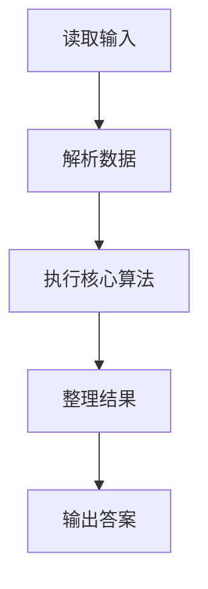
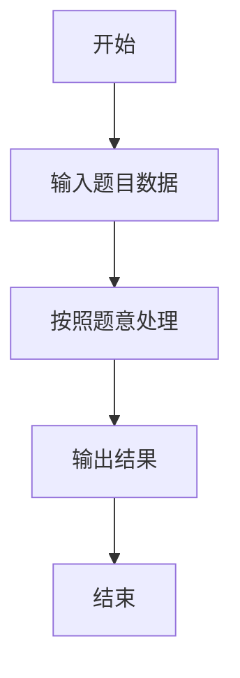

# L3-032 - 关于深度优先搜索和逆序对的题应该不会很难吧这件事（30 分）

- **时间限制**: 1000 ms
- **内存限制**: 262144 KB
- **代码长度限制**: 16 KB

---

## 题目描述


## 示例

### 示例 1

**输入:**
```
无
```

**输出:**
```

```

### 解题思路

本题的 Ruby 实现采用字符串解析与规则处理。程序先读取题目输入，建立与题意对应的数据结构，按照约束完成核心计算，并按规定格式输出结果。具体实现以同目录的 main.rb 为准。

### 代码流程说明

1. 读取并解析标准输入，转换为题目所需的数据结构。
2. 按题意执行核心算法，维护中间状态并处理边界情况。
3. 整理计算结果，按照输出格式生成答案。

### 代码实现

完整实现位于同目录的 [main.rb](./main.rb)，以下代码与该入口文件保持一致。

```ruby
# frozen_string_literal: true
require_relative '../gplt_runtime'
def entry
  py_mod = 1000000007
  main = lambda do ||
    a = (py_map(->(x) { py_int(x) }, py_tokens).to_a)
    if (!py_truth(a))
      return
    end
    n, r = py_slice(a, nil, 2, nil)
    p = 2
    g = py_iterable(py_range((n + 1))).flat_map { |_|; [[]] }
    for _ in py_range((n - 1))
      u, v = py_slice(a, p, (p + 2), nil)
      p += 2
      g[u].append(v)
      g[v].append(u)
    end
    par = ([0] * (n + 1))
    ch = py_iterable(py_range((n + 1))).flat_map { |_|; [[]] }
    order = [r]
    par[r] = (-1)
    for u in order
      for v in g[u]
        if ((v != par[u]))
          par[v] = u
          ch[u].append(v)
          order.append(v)
        end
      end
    end
    sz = ([1] * (n + 1))
    for u in py_slice(order, nil, nil, (-1))
      if ((par[u] > 0))
        sz[par[u]] += sz[u]
      end
    end
    fact = ([1] * (n + 1))
    for i in py_range(1, (n + 1))
      fact[i] = ((fact[(i - 1)] * i) % py_mod)
    end
    ways = 1
    for u in py_range(1, (n + 1))
      ways = ((ways * fact[py_len(ch[u])]) % py_mod)
    end
    bit = ([0] * (n + 2))
    add = lambda do |i|
      while ((i <= n))
        bit[i] += 1
        i += (i & (-i))
      end
    end
    sm = lambda do |i|
      z = 0
      while py_truth(i)
        z += bit[i]
        i -= (i & (-i))
      end
      return z
    end
    fixed = 0
    stack = [[r, 0, 0]]
    while py_truth(stack)
      u, state, anc = stack.pop()
      if ((state == 0))
        fixed += (anc - sm.call(u))
        add.call(u)
        stack.append([u, 1, (anc + 1)])
        for v in py_slice(ch[u], nil, nil, (-1))
          stack.append([v, 0, (anc + 1)])
        end
        else
          i = u
          while ((i <= n))
            bit[i] -= 1
            i += (i & (-i))
          end
      end
    end
    anc = py_sum(py_iterable(py_range(1, (n + 1))).flat_map { |u|; [(sz[u] - 1)] })
    inc = (((n * (n - 1)).div(2)) - anc)
    py_print(((ways * (fixed + (inc * py_pow(2, (py_mod - 2), py_mod)))) % py_mod), sep: " ", ending: "\n")
  end
  main.call
end
entry
```

### 代码流程图



### 解题流程图


