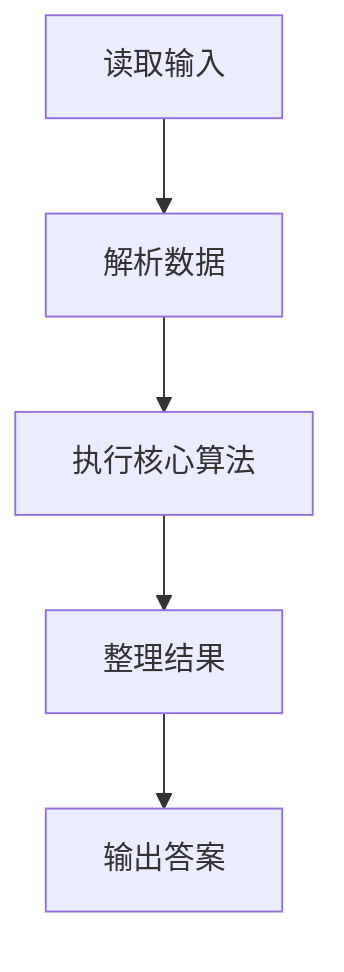
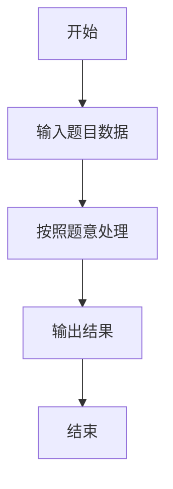

# L3-033 - 教科书般的亵渎（30 分）

- **时间限制**: 2000 ms
- **内存限制**: 262144 KB
- **代码长度限制**: 16 KB

---

## 题目描述


九条可怜最近在玩一款卡牌游戏。在每一局游戏中，可怜都要使用抽到的卡牌来消灭一些敌人。每一名敌人都有一个初始血量，而当血量降低到 $$0$$ 及以下的时候，这名敌人就会立即被消灭并从场上消失。

现在，可怜面前有 $$n$$ 个敌人，其中第 $$i$$ 名敌人的血量是 $$a_i$$，而可怜手上只有如下两张手牌：

1. 如果场上还有敌人，等概率随机选中一个敌人并对它造成一点伤害（即血量减 $$1$$），重复 $$K$$ 次。

2. 对所有敌人造成一点伤害，重复该效果直到没有新的敌人被消灭。

下面是这两张手牌效果的一些示例：

1. 假设存在两名敌人，他们的血量分别是 $$1, 2$$ 且 $$K = 2$$。那么在可怜打出第一张手牌后，可能会发生如下情况：

- 第一轮中，两名敌人各有 $$0.5$$ 的概率被选中。假设第一名敌人被选中，那么它会被造成一点伤害。这时它的血量变成了 $$0$$，因此它被消灭并消失了。
- 第二轮中，因为场上只剩下了第二名敌人，所以它一定会被选中并被造成一点伤害。这时它剩下的血量为 $$1$$。

2. 同样假设存在两名敌人且血量分别为 $$1, 2$$。那么在可怜打出第二张手牌后，会发生如下情况：

- 第一轮中，所有敌人被造成了一点伤害。这时第一名敌人被消灭了，因此卡牌效果会被重复一遍。
- 第二轮中，所有敌人（此时只剩下第二名敌人了）被造成了一点伤害。这时第二名敌人也被消灭了，因此卡牌效果会被再重复一遍。
- 第三轮中，所有敌人（此时没有敌人剩下了）被造成了一点伤害。因为没有新的敌人被消灭了，所以卡牌效果结束。

3. 如果面对的是四名血量分别为 $$1,2,2,4$$ 的敌人，那么在可怜打出第二张手牌后，只有第四名敌人还会存活，且它的剩余血量为 $$1$$。

现在，可怜先打出了第一张手牌，再打出了第二张手牌。她发现，在第一张手牌效果结束后，没有任何一名敌人被消灭，但是在第二张手牌的效果结束后，所有敌人都被消灭了。

可怜想让你计算一下这种情况发生的概率是多少。

### 输入格式:

第一行输入两个整数 $$n, K(1 \le n, K \le 50)$$，分别表示敌人的数量以及第一张卡牌效果的发动次数。

第二行输入 $$n$$ 个由空格隔开的整数 $$a_i (1 \le a_i \le 50)$$，表示每个敌人的初始血量。

### 输出格式:

在一行中输出一个整数，表示发生概率对 $$998244353$$ 取模后的结果。

具体来说，如果概率的最简分数表示为 $$a/b (a \ge 0, b \ge 1, \gcd(a,b) = 1)$$，那么你需要输出 

$$a \times b^{998244351} \mod 998244353$$。

### 输入样例 1：
```in
3 2
2 3 3
```

### 输出样例 1：
```out
665496236
```

### 输入样例 2：
```in
3 3
2 3 3
```

### 输出样例 2：
```out
776412275
```

### 输入样例 3：
```in
5 3
1 4 4 2 5
```

### 输出样例 3：
```out
367353922
```

### 输入样例 4：
```in
12 12
1 2 3 4 5 6 7 8 9 10 11 12
```

### 输出样例 4：
```out
452061016
```

## 示例

### 示例 1

**输入:**
```
3 2
2 3 3
```

**输出:**
```
665496236
```

### 示例 2

**输入:**
```
3 3
2 3 3
```

**输出:**
```
776412275
```

### 示例 3

**输入:**
```
5 3
1 4 4 2 5
```

**输出:**
```
367353922
```

### 示例 4

**输入:**
```
12 12
1 2 3 4 5 6 7 8 9 10 11 12
```

**输出:**
```
452061016
```

### 解题思路

本题的 Ruby 实现采用动态规划或状态转移。程序先读取题目输入，建立与题意对应的数据结构，按照约束完成核心计算，并按规定格式输出结果。具体实现以同目录的 main.rb 为准。

### 代码流程说明

1. 读取并解析标准输入，转换为题目所需的数据结构。
2. 按题意执行核心算法，维护中间状态并处理边界情况。
3. 整理计算结果，按照输出格式生成答案。

### 代码实现

完整实现位于同目录的 [main.rb](./L3-033_教科书般的亵渎/main.rb)，以下代码与该入口文件保持一致。

```ruby
# frozen_string_literal: true
require_relative '../gplt_runtime'
def entry
  py_mod = 998244353
  main = lambda do ||
    z = (py_map(->(x) { py_int(x) }, py_tokens).to_a)
    if (!py_truth(z))
      return
    end
    n, py_k = py_slice(z, nil, 2, nil)
    a = py_slice(z, 2, (2 + n), nil)
    invf = ([1] * (py_k + 1))
    f = ([1] * (py_k + 1))
    for i in py_range(1, (py_k + 1))
      f[i] = ((f[(i - 1)] * i) % py_mod)
    end
    invf[py_k] = py_pow(f[py_k], (py_mod - 2), py_mod)
    for i in py_range(py_k, 0, (-1))
      invf[(i - 1)] = ((invf[i] * i) % py_mod)
    end
    dp = py_iterable(py_range((py_k + 1))).flat_map { |_|; [{}] }
    dp[0][0] = 1
    for hp in a
      nd = py_iterable(py_range((py_k + 1))).flat_map { |_|; [{}] }
      for used, mp in py_enumerate(dp)
        for mask, w in mp.items()
          for c in py_range((py_min((hp - 1), (py_k - used)) + 1))
            b = (hp - c)
            nm = (mask | (1 << (b - 1)))
            d = nd[(used + c)]
            d[nm] = ((d.fetch(nm, 0) + (w * invf[c])) % py_mod)
          end
        end
      end
      dp = nd
    end
    s = (py_sum(py_iterable(dp[py_k].items()).flat_map { |__item_0|; mask, v = __item_0; next [] unless py_truth((((mask & (mask + 1)) == 0))); [v] }) % py_mod)
    py_print(((((s * f[py_k]) % py_mod) * py_pow(py_pow(n, py_k, py_mod), (py_mod - 2), py_mod)) % py_mod), sep: " ", ending: "\n")
  end
  main.call
end
entry
```

### 代码流程图



### 解题流程图


