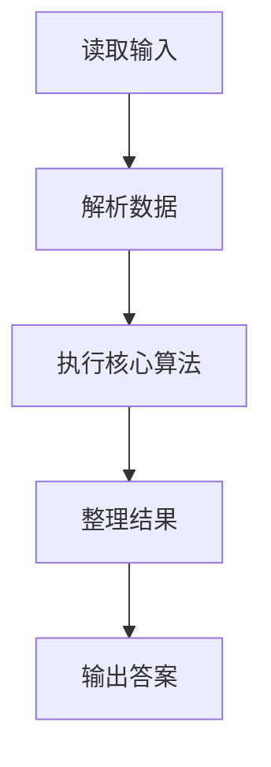
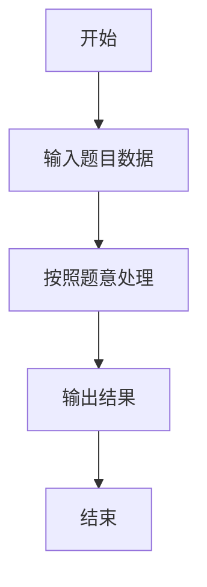

# L3-035 - 完美树（30 分）

- **时间限制**: 400 ms
- **内存限制**: 262144 KB
- **代码长度限制**: 16 KB

---

## 题目描述


给定一棵有 $N$ 个结点的树（树中结点从 $1$ 到 $N$ 编号，根结点编号为 $1$）。每个结点有一种颜色，或为黑，或为白。

称以结点 $u$ 为根的子树是 **好的**，若子树中黑色结点与白色结点的数量之差的绝对值不超过 $1$。称整棵树是 **完美树**，若对于所有 $1 \le i \le N$，以结点 $i$ 为根的子树都是好的。

你需要将整棵树变成完美树，为此你可以进行以下操作任意次（包括零次）：选择任意一个结点 $i$  ($1 \le i \le N$)，改变结点 $i$ 的颜色（若结点 $i$ 目前是黑色则将其改为白色，若结点 $i$ 目前是白色则将其改为黑色）。这次操作的代价为 $P_i$。

求将给定的树变为完美树的最小代价。

注：以结点 $i$ 为根的子树，由结点 $i$ 以及结点 $i$ 的所有后代结点组成。

### 输入格式:

输入第一行为一个数 $N$ ($1 \le N \le 10^5$)，表示树的结点个数。

接下来的 $N$ 行，第 $i$ 行的前三个数为 $C_i, P_i, K_i$ ($1 \le P_i \le 10^4, 0 \le K_i \le N$)，分别表示树上编号为 $i$ 的结点的初始颜色（$0$ 为白色，$1$ 为黑色）、变换颜色的代价及孩子结点的数量。紧跟着有 $K_i$ 个数，为孩子结点的编号。数字均用一个空格隔开，所有的编号保证在 $1$ 到 $N$ 里，且不会有环。

数据中只包含一棵树。

### 输出格式:

输出一行一个数，表示将树 $T$ 变为完美树的最小代价。

### 输入样例:
```in
10
1 100 3 2 3 4
0 20 1 7
0 5 2 5 6
0 8 1 10
0 7 0
0 2 0
1 1 2 8 9
0 15 0
0 13 0
1 8 0
```

### 输出样例:
```out
15
```

## 示例

### 示例 1

**输入:**
```
10
1 100 3 2 3 4
0 20 1 7
0 5 2 5 6
0 8 1 10
0 7 0
0 2 0
1 1 2 8 9
0 15 0
0 13 0
1 8 0
```

**输出:**
```
15
```

### 解题思路

本题的 Ruby 实现采用动态规划或状态转移。程序先读取题目输入，建立与题意对应的数据结构，按照约束完成核心计算，并按规定格式输出结果。具体实现以同目录的 main.rb 为准。

### 代码流程说明

1. 读取并解析标准输入，转换为题目所需的数据结构。
2. 按题意执行核心算法，维护中间状态并处理边界情况。
3. 整理计算结果，按照输出格式生成答案。

### 代码实现

完整实现位于同目录的 [main.rb](./main.rb)，以下代码与该入口文件保持一致。

```ruby
# frozen_string_literal: true
require_relative '../gplt_runtime'
v = py_tokens.map(&:to_i)
n = v.shift
children = Array.new(n + 1) { [] }
color = Array.new(n + 1)
flip_cost = Array.new(n + 1, 0)
n.times do |i|
  u = i + 1
  color[u] = v.shift
  flip_cost[u] = v.shift
  k = v.shift
  children[u] = v.shift(k)
end
order = [1]
idx = 0
while idx < order.length
  order.concat(children[order[idx]])
  idx += 1
end
dp = Array.new(n + 1) { {} }
order.reverse_each do |u|
  sums = { 0 => 0 }
  children[u].each do |child|
    next_sums = Hash.new(1 << 60)
    sums.each do |sum, cost|
      dp[child].each { |difference, child_cost| next_sums[sum + difference] = [next_sums[sum + difference], cost + child_cost].min }
    end
    sums = next_sums
  end
  [-1, 0, 1].each do |difference|
    best = 1 << 60
    [-1, 1].each do |own|
      required = difference - own
      next unless sums.key?(required)
      change = color[u] == (own == 1 ? 1 : 0) ? 0 : flip_cost[u]
      best = [best, sums[required] + change].min
    end
    dp[u][difference] = best
  end
end
py_print(dp[1].values.min)
```

### 代码流程图



### 解题流程图


