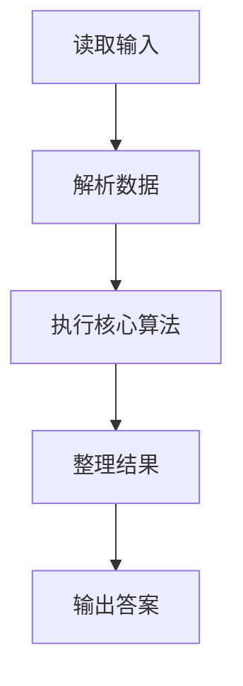
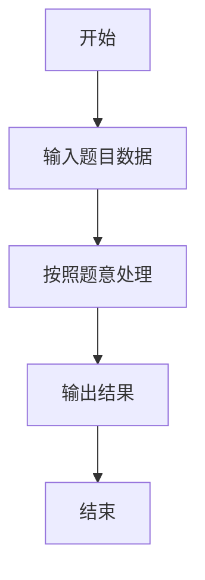

# L3-036 - 血染钟楼（30 分）

- **时间限制**: 6000 ms
- **内存限制**: 65536 KB
- **代码长度限制**: 16 KB

---

## 题目描述


九条可怜最近非常沉迷血染钟楼 —— 一款类狼人杀的身份推理类的游戏。在一局血染钟楼的游戏中，玩家们之间隐藏着一名"恶魔"，而所有善良玩家的目标就是将抽到恶魔身份的玩家绳之以法。

今天，九条可怜和她的小伙伴们开了一局 $n+1$ 名玩家参与的游戏，可怜的编号是 $0$，其他玩家编号从 $1$ 到 $n$。
可怜抽到的身份是占卜师，其技能如下（注意这儿和标准钟楼规则有出入）：

1. 每个夜晚，你可以选择任意名玩家，并得知被选择的玩家中是否有恶魔。
2. 有一名除你以外善良玩家始终被你的能力视为恶魔。

换句话说，在剩下的 $n$ 名玩家中，存在着两名未知的玩家，如果这两名玩家均未被可怜选中，可怜就会得到信息 0，否则就会得到信息 1。
在抽到身份的时候，可怜就对游戏开始的前 $m$ 个夜晚进行了规划：她打算在第 $i$ 个夜晚选中编号在区间 $[l_i, r_i]$ 内的所有玩家。
因为血染钟楼的第一个夜晚通常比较漫长，所以可怜在百无聊赖之际开始了头脑风暴。如果一切顺利，在 $m$ 晚之后，她将能得到 $m$ 个 0 或 1 的信息，共有 $2^m$ 种不同的可能性。可怜想要知道在这些可能性中，有多少种结果是可能发生的且可以让她**唯一**确定被她技能识别的两名玩家。

### 输入格式:

第一行输入一个整数 $t (1 \leq t \leq 10^3)$，表示数据组数。
第二行输入两个整数 $n, m(1 \leq n,m \leq 10^5)$，表示可怜以外的玩家数量以及可怜规划的夜晚数量。
接下来 $m$ 行每行两个整数 $l_i, r_i (1 \leq l_i \leq r_i \leq n)$，表示可怜的计划中在第 $i$ 晚会被选中的玩家编号区间。
输入保证所有数据中满足 $n > 10^3$ 或 $m > 10^3$ 的数据不超过 $5$ 组。

### 输出格式:

对于每组数据，输出一行一个整数，表示满足条件的可能性数量。答案可能很大，你只需要输出对 $998244353$ 取模后的结果。

### 输入样例:
```in
3
4 1
2 3
5 4
2 5
1 3
5 5
2 4
10 10
1 2
6 6
3 7
3 6
1 8
9 10
1 6
4 4
8 8
5 8
```

### 输出样例:
```out
1
2
7
```

## 示例

### 示例 1

**输入:**
```
3
4 1
2 3
5 4
2 5
1 3
5 5
2 4
10 10
1 2
6 6
3 7
3 6
1 8
9 10
1 6
4 4
8 8
5 8
```

**输出:**
```
1
2
7
```

### 解题思路

本题的 Ruby 实现采用字符串解析与规则处理。程序先读取题目输入，建立与题意对应的数据结构，按照约束完成核心计算，并按规定格式输出结果。具体实现以同目录的 main.rb 为准。

### 代码流程说明

1. 读取并解析标准输入，转换为题目所需的数据结构。
2. 按题意执行核心算法，维护中间状态并处理边界情况。
3. 整理计算结果，按照输出格式生成答案。

### 代码实现

完整实现位于同目录的 [main.rb](./L3-036_血染钟楼/main.rb)，以下代码与该入口文件保持一致。

```ruby
# frozen_string_literal: true
require_relative '../gplt_runtime'
v = py_tokens.map(&:to_i)
t = v.shift
answers = []
t.times do
  n, m = v.shift(2)
  ranges = m.times.map { [v.shift, v.shift] }
  masks = Array.new(n + 1, 0)
  ranges.each_with_index { |(l, r), i| (l..r).each { |x| masks[x] |= 1 << i } }
  counts = Hash.new(0)
  (1..n).each do |x|
    (x + 1..n).each do |y|
      counts[masks[x] | masks[y]] += 1
    end
  end
  answers << (counts.count { |_, count| count == 1 } % 998_244_353)
end
py_print(answers.join("\n"))
```

### 代码流程图



### 解题流程图


