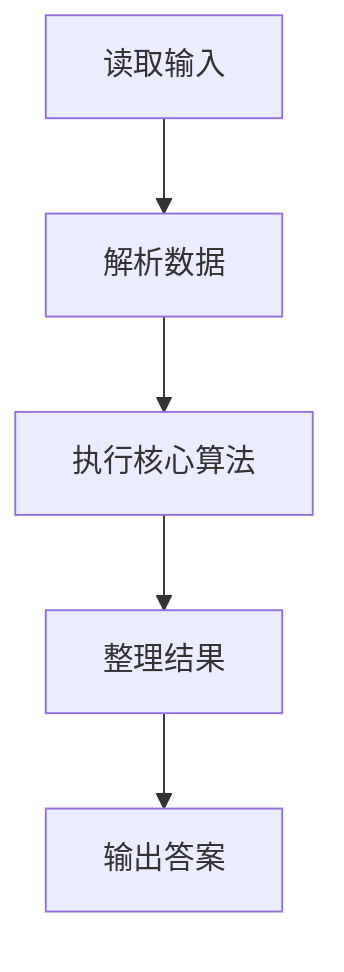
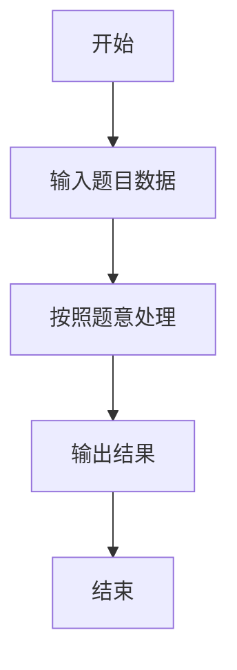

# L3-037 - 夺宝大赛（30 分）

- **时间限制**: 400 ms
- **内存限制**: 65536 KB
- **代码长度限制**: 16 KB

---

## 题目描述


夺宝大赛的地图是一个由 $n\times m$ 个方格子组成的长方形，主办方在地图上标明了所有障碍、以及大本营宝藏的位置。参赛的队伍一开始被随机投放在地图的各个方格里，同时开始向大本营进发。所有参赛队从一个方格移动到另一个无障碍的相邻方格（“相邻”是指两个方格有一条公共边）所花的时间都是 1 个单位时间。但当有多支队伍同时进入大本营时，必将发生火拼，造成参与火拼的所有队伍无法继续比赛。大赛规定：最先到达大本营并能活着夺宝的队伍获得胜利。
假设所有队伍都将以最快速度冲向大本营，请你判断哪个队伍将获得最后的胜利。

### 输入格式:

输入首先在第一行给出两个正整数 $m$ 和 $n$（$2< m,n\le 100$），随后 $m$ 行，每行给出 $n$ 个数字，表示地图上对应方格的状态：$1$ 表示方格可通过；$0$ 表示该方格有障碍物，不可通行；$2$ 表示该方格是大本营。题目保证只有 1 个大本营。
接下来是参赛队伍信息。首先在一行中给出正整数 $k$（$0<k<m\times n/2$），随后 $k$ 行，第 $i$（$1\le i \le k$）行给出编号为 $i$ 的参赛队的初始落脚点的坐标，格式为 `x y`。这里规定地图左上角坐标为 `1 1`，右下角坐标为 `n m`，其中 `n` 为列数，`m` 为行数。注意参赛队只能在地图范围内移动，不得走出地图。题目保证没有参赛队一开始就落在有障碍的方格里。

### 输出格式:

在一行中输出获胜的队伍编号和其到达大本营所用的单位时间数量，数字间以 1 个空格分隔，行首尾不得有多余空格。若没有队伍能获胜，则在一行中输出 `No winner.`

### 输入样例 1：
```in
5 7
1 1 1 1 1 0 1
1 1 1 1 1 0 0
1 1 0 2 1 1 1
1 1 0 0 1 1 1
1 1 1 1 1 1 1
7
1 5
7 1
1 1
5 5
3 1
3 5
1 4
```

### 输出样例 1：
```out
7 6
```

### 输入样例 2：
```in
5 7
1 1 1 1 1 0 1
1 1 1 1 1 0 0
1 1 0 2 1 1 1
1 1 0 0 1 1 1
1 1 1 1 1 1 1
7
7 5
1 3
7 1
1 1
5 5
3 1
3 5
```

### 输出样例 2：
```out
No winner.
```

## 示例

### 示例 1

**输入:**
```
5 7
1 1 1 1 1 0 1
1 1 1 1 1 0 0
1 1 0 2 1 1 1
1 1 0 0 1 1 1
1 1 1 1 1 1 1
7
1 5
7 1
1 1
5 5
3 1
3 5
1 4
```

**输出:**
```
7 6
```

### 示例 2

**输入:**
```
5 7
1 1 1 1 1 0 1
1 1 1 1 1 0 0
1 1 0 2 1 1 1
1 1 0 0 1 1 1
1 1 1 1 1 1 1
7
7 5
1 3
7 1
1 1
5 5
3 1
3 5
```

**输出:**
```
No winner.
```

### 解题思路

本题的 Ruby 实现采用排序、贪心与顺序模拟。程序先读取题目输入，建立与题意对应的数据结构，按照约束完成核心计算，并按规定格式输出结果。具体实现以同目录的 main.rb 为准。

### 代码流程说明

1. 读取并解析标准输入，转换为题目所需的数据结构。
2. 按题意执行核心算法，维护中间状态并处理边界情况。
3. 整理计算结果，按照输出格式生成答案。

### 代码实现

完整实现位于同目录的 [main.rb](./L3-037_夺宝大赛/main.rb)，以下代码与该入口文件保持一致。

```ruby
# frozen_string_literal: true
require_relative '../gplt_runtime'
def entry
  main = lambda do ||
    z = (py_map(->(x) { py_int(x) }, py_tokens).to_a)
    if (!py_truth(z))
      return
    end
    m, n = py_slice(z, nil, 2, nil)
    p = 2
    g = py_iterable(py_range(m)).flat_map { |i|; [py_slice(z, (p + (i * n)), (p + ((i + 1) * n)), nil)] }
    p += (m * n)
    for i in py_range(m)
      for j in py_range(n)
        if ((g[i][j] == 2))
          tar = [i, j]
        end
      end
    end
    d = py_iterable(py_range(m)).flat_map { |_|; [([(-1)] * n)] }
    d[tar[0]][tar[1]] = 0
    q = [tar]
    while py_truth(q)
      x, y = q.popleft()
      for dx, dy in [[1, 0], [(-1), 0], [0, 1], [0, (-1)]]
        a, b = [(x + dx), (y + dy)]
        if (((0 <= a) && (a < m)) && ((0 <= b) && (b < n)) && py_truth(g[a][b]) && ((d[a][b] < 0)))
          d[a][b] = (d[x][y] + 1)
          q.append([a, b])
        end
      end
    end
    k = z[p]
    p += 1
    arr = []
    for i in py_range(1, (k + 1))
      x, y = py_slice(z, p, (p + 2), nil)
      p += 2
      dd = d[(y - 1)][(x - 1)]
      if ((dd >= 0))
        arr.append([dd, i])
      end
    end
    for dd, i in py_sorted(arr)
      if ((py_sum(py_iterable(arr).flat_map { |x|; [((x[0] == dd))] }) == 1))
        py_print(i, dd, sep: " ", ending: "\n")
        return
      end
    end
    py_print("No winner.", sep: " ", ending: "\n")
  end
  main.call
end
entry
```

### 代码流程图



### 解题流程图


